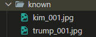

# disinfection

## 需求

检测人员在指定区域，是否达到规定时间，应用yolo-pose模型并且结合insightface人脸识别，完成此任务

如果人员进场但没有在指定区域待够规定时间，则发送报告（这里是通过邮件发送的）

## 模型

起初用的是ultralytics自己的yolo11n-pose模型，但是使用一段时间后会将棍状物体识别为人腿，所以自己又在它的基础上做了训练：

```python
from ultralytics import YOLO

# Load a model
model = YOLO("yolo11n.pt")  # load a pretrained model (recommended for training)

# Train the model
results = model.train(data="Objects365.yaml", epochs=100,device=[1,2], imgsz=640)
```

## 人脸识别

在known目录创建以人员姓名为文件名的图片文件：



这里的照片同一个人可以有多个照片，由于程序的设计在后面加个序号，一般是人员的大头照通过五官识别

## 运行
```shell
chmod +x start_detector.sh
bash start_detector.sh
```

## 配置

在[配置文件](./configs/config.yaml)可以做以下修改


名称 | 说明
----|----
 place  | 命名为将抓取人员的照片目录
 cuda | 用到的显卡索引
 pool_npy | 人员要检测的指定区域
 road_npy | 为了减少程序的不必要计算消耗划定摄像头检测的范围
 outputs | 最终不合格人员的相关照片将通过邮件发送的配置信息
